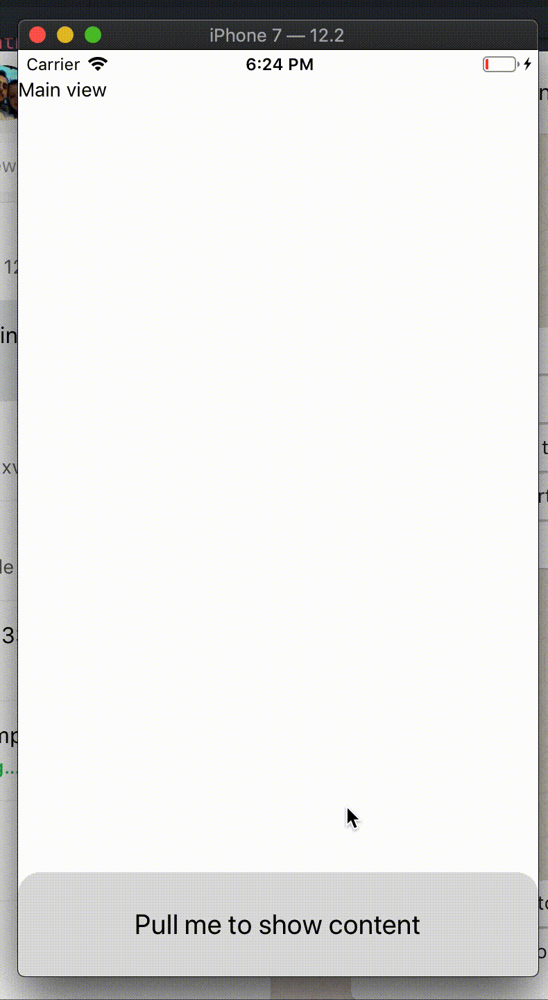

# `react-native-pullie`



(it's not slow, the gif has a low framerate)

## 🤔 What on earth is that?

This is a fully customizable pull-from-bottom-view, useful for displaying extra information on the screen without having to worry too much about space.

## 📖 Installation

**NOTE: REACT-NATIVE >= 0.59.0 REQUIRED. We're usingHooks()!**

`yarn add react-native-pullie`

## 💡 Minimum usage Example

```js
import React from 'react'
import { View, Text } from 'react-native'
import Pullie from 'react-native-pullie'

function MyView() {
  const [isOpen, setIsOpen] = React.useState(false)

  return (
    <React.Fragment>
      {/* my content... */}
      <Pullie
        isOpen={isOpen}
        setIsOpen={setIsOpen}
        teaser={
          <View style={{ height: 70 }}>
            <Text>Drag me</Text>
          </View>
        }
        teaserHeight={70}
      >
        <View>
          <Text>Hey there!</Text>
        </View>
      </Pullie>
    </React.Fragment>
  )
}
```

As you can see, it's a controlled component: it only opens if you want to and you close it programmatically (using context, for example).

## 🛠 Props

| Name                     | Description                                 | Type              | Required (default) |
| ------------------------ | ------------------------------------------- | ----------------- | ------------------ |
| `isOpen`                 | If the `Pullie` is opened                   | `boolean`         | Yes                |
| `setIsOpen`              | A `callback` fired when the view was opened | `function(bool)`  | Yes                |
| `children`               | The content                                 | `React.ReactNode` | Yes                |
| `teaser`                 | The pullable content                        | `React.ReactNode` | Yes                |
| `teaserHeight`           | The height of the `teaser`                  | `number`          | No (70)            |
| `screenHeightPercentage` | The % of the screen that will be filled     | `number`          | No (70)            |
| `backdropOpacity`        | The opacity of the backdrop when opened     | `number`          | No (70)            |
| `style`                  | The styles of the wrapper component         | `ViewProps.style` | No                 |

## 😳 Known issues / TODO

- the backdrop suddenly disappears on click instead of fading out gracefully;
- it's boring to specify a teaser height, maybe use the `onLayout` callback to measure it;
- make an uncontrolled version.

## 👍 How to contribute

Have an idea? Found a bug? Please file an issue. Contributions are welcome and are greatly appreciated! Every little bit helps, and credit will always be given.

## ✨ Credits

This library is basically [react-native-bottom-drawer](https://github.com/rationalappdev/react-native-bottom-drawer) rewritten with the purpose of fitting my needs at [toodo](http://toodo.com.br). Huge kudos to [@rationalappdev](https://github.com/rationalappdev).

## 📜 License

MIT
